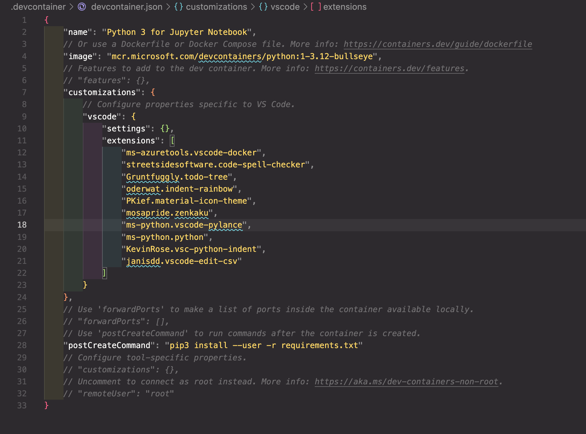

<!-- Mermaidを読み込み -->
<!-- これを読み込まないとmermaidがVSCode拡張機能やHTMLで正しく表示されません。 -->
<script type="module">
import mermaid from 'https://cdn.jsdelivr.net/npm/mermaid@11.4.1/dist/mermaid.esm.min.mjs';
mermaid.initialize({ startOnLoad: true });
</script>
<!-- Mermaidを読み込み -->

# データサイエンティストのための

# ソフトウェア工学入門

<div style="display: flex; justify-content: center;">
    
</div>

---

# 目次

1. ソフトウェア工学の重要性
   - なぜソフトウェア工学が必要か？
   - 車輪の再発明を防ぐ
   - 巨人の肩に乗る
2. 用法用量を守って
   - 高度化するソフトウェア開発
   - 適切なコーディング手法の選択
   - 帰納と演算
   - 個人とチームと消費期限
3. 効果的なコーディング手法
   - コメントの重要性
   - 可読性の高いコード作成
   - コーディング規約

---

4. 開発環境の構築と活用
   - VSCode と Jupyter Notebook
   - devcontainer による環境統一
5. AI ツールの活用
   - GitHub Copilot の活用
   - Cursor の活用
6. まとめ
   - まとめ
   - 参考資料
   - 参考文献
   - 最後に補足(Marp について)

---

# 1. ソフトウェア工学の重要性

<pre class="mermaid">
mindmap
  root((ソフトウェア工学))
    車輪の再発明を防ぐ
      既存ライブラリの活用
      ベストプラクティス
      設計パターン
    巨人の肩に乗る
      オープンソース
      コミュニティ
      ドキュメント
    効率的な開発
      チーム開発
      品質管理
      保守性
</pre>

---

## 1.1 なぜソフトウェア工学が必要か？

データサイエンティストにとって、ソフトウェア工学の知識が重要な理由：

- **再現性の確保**

  - 分析結果の再現
  - 他者との共同作業

- **保守性の向上**
  - 6 ヶ月後の自分が理解できるコード
  - チームでの開発効率向上

---

## 1.2 車輪の再発明を防ぐ

<div style="display: flex; justify-content: center; gap: 2rem;">
  <div>
    <p style="font-weight: bold; font-size: 40px;">既存ライブラリの活用</p>
    <p>欲しい機能は既にある可能性が高い</p>
    <p>機能の再開発に時間をかける必要がない</p>
    <p>バグが発生する可能性が低い</p>
  </div>

  <div style="flex-shrink: 0;">
    
  </div>
</div>

---

## 1.3 巨人の肩に乗る

<div style="display: flex; justify-content: center; gap: 2rem;">
  <div>
    <p style="font-weight: bold; font-size: 40px;">オープンソース</p>
    <p >先人たちの知見を活用</p>
    <p >保守性が高い</p>
    <p style="font-weight: bold; font-size: 40px;">機能拡張</p>
    <p >自分では思いつかないような機能を利用できる</p>
    <p >人生は有限</p>

  </div>

  <div style="flex-shrink: 0;">
    
  </div>
</div>

---

# 2. 用法用量を守って

高度化するソフトウェア開発の手法を利用することは重要ですが、その利用にはユースケースに応じた手法を選択することが重要です。

---

## 2.1 高度化するソフトウェア開発

<pre class="mermaid">
mindmap
  root((ソフトウェア開発))
    開発規模
      チーム開発
      大規模開発
      保守・運用
    開発プロセス
      要件定義
      設計
      実装
      テスト
      デプロイ
    品質管理
      コードレビュー
      自動テスト
      継続的インテグレーション
      ドキュメント
    技術スタック
      言語選択
      フレームワーク
      開発ツール
      バージョン管理
</pre>

---

## 2.2 適切なコーディング手法の選択

```c
// メモリー割当
#include <stdlib.h>

void memory_leak_example() {
    int *ptr = (int *)malloc(10 * sizeof(int));
    // メモリーリーク: mallocで確保したメモリが解放(free)されていない
}
```

<div style="display: flex; justify-content: center; gap: 2rem;">

  <div style="flex-shrink: 1;">
    
  </div>
    <div style="flex-shrink: 1;">
    
  </div>
</div>

---

## 2.3 帰納と演算

**帰納法**は個別の事例や観察から一般的な法則や結論を導き出す思考方法です。
例えば「今まで見たカラスは全て黒かった → カラスは黒い」というような推論です。多くの具体例から共通点を見出し、一般化するプロセスです。

**演繹法**は一般的な法則や前提から個別の結論を導き出す思考方法です。例えば「全ての哺乳類は心臓を持つ。犬は哺乳類である。→ 従って犬は心臓を持つ」というような推論です。

- 思考の方向性

  - 帰納法: 個別 → 一般
  - 演繹法: 一般 → 個別

- 確実性
  - 帰納法: 結論は確率的・蓋然的
  - 演繹法: 前提が正しければ結論は必然的に正しい

---

### 帰納的アプローチ

帰納的アプローチは、**具体的な事例や観察から一般的な法則や原理を導き出す手法**です。これは、個々のケースを分析し、それらの共通点やパターンを見つけ出すことで、より広範な結論を得ることを目指します。

例えば、データサイエンスの分野では、様々なデータセットを分析して、その中で共通するパターンや傾向を見つけ出すことが多くあります。このような分析を通じて、新しいデータセットに対しても同様の傾向があると推測することができます。

帰納的アプローチの利点は、実際のデータや経験に基づいているため、現実的で実践的な解決策を提供できる点です。しかし、観察された事例が限られている場合や、偏りがある場合には、導き出された結論が必ずしも正確でない可能性があるため、注意が必要です。

---

### 帰納的アプローチの例

```python
import pandas as pd
import numpy as np
from typing import Dict

def calculate_metrics(data: pd.DataFrame) -> Dict[str, float]:
    """月次売上データの基本的な統計量と傾向を計算する
    """
    return {
        # 基本統計量
        'sales_mean': data['sales'].mean(),
        'sales_median': data['sales'].median(),
        'sales_std': data['sales'].std(),

        # トレンド（前年同月比）
        'yoy_growth': (data['sales'].iloc[-1] / data['sales'].iloc[-13] - 1) * 100,

        # 季節性（月別平均）
        'monthly_avg': data.groupby(data['date'].dt.month)['sales'].mean().to_dict()
    }

})
```

---

## 2.3 帰納と演算

### 演繹的アプローチ

演繹的アプローチは、**一般的な原理や法則から具体的な結論や予測を導き出す手法**です。これは、既存の理論や原理を前提として、それらを論理的に推論することで、新しい結論を得ることを目指します。

例えば、特定の設計パターンが成功を収めていることを観察した場合、その設計パターンが他のプロジェクトでも有効であると推測することができます。このようにして得られた知見は、新しいプロジェクトにおける意思決定や戦略の策定に役立ちます。

ソフトウェア開発においては、演繹的アプローチは一般的な手法であり、原理原則を絶対のものとして最適な設計や実装を行っていきます。

---

### 演繹的アプローチの例

```python
# FastAPI のサンプルコード
from fastapi import FastAPI

app = FastAPI()

@app.get("/")
def read_root():
    """
    2つの数値を足し合わせて返す
    """
    a = 1
    b = 2
    sum_of_a_and_b = a + b
    return {"result": sum_of_a_and_b}
```

---

## 2.4 個人とチームと消費期限

ソフトウェア開発においては通常、複数人での開発が行われます。
そのため、**「自分だけが分かれば良いコード」ではなく、「チームでも分かるコード」** を作成することが重要です。

この点でもデータサイエンスにおけるコーディングとは異なる点があると思います。
多くのケースではデータサイエンティストは一人でコーディングを行うことが多いため、再利用性やコメントの重要性は低いものになっているかと思います。
また、成果物であるコードについても、保守性やメンテンナンス性を高く保つ必要があるケースは稀であるため、コードの可読性、保守性、再利用性は低いものであっても構いません。

ただ、**「1 ヶ月後の自分は他人」** という認識を持つことで、未来の自分が困らないコーディングを行うことはとても重要なものであると考えています。

---

# 3. 効果的なコーディング手法

開発効率を上げる代表的なコーディング手法を紹介します。
より高度なコーディング手法は扱うプログラミング言語やユースケースによって異なるため、ここでは紹介しません。
初歩的ではありますが、コーディングの質を高めるコメントと可読性について紹介します。

---

## 3.1 コメントの重要性

```python
# 悪いコメントの例
def calculate_metrics(data: pd.DataFrame) -> Dict[str, float]:
    # データをクリッピングする
    cleaned_data = clip_outliers(data, percentile=99)
    # 統計量を計算する
    return compute_statistics(cleaned_data)
```

---

```python
# 良いコメントの例
def calculate_metrics(data: pd.DataFrame) -> Dict[str, float]:
    """データセットの基本的な統計量を計算する

    Args:
        data: 分析対象のデータフレーム
    Returns:
        統計量の辞書（平均、中央値、標準偏差など）
    """
    # 異常値の影響を軽減するため、99パーセンタイルでクリッピング
    cleaned_data = clip_outliers(data, percentile=99)
    return compute_statistics(cleaned_data)
```

---

## 3.2 可読性の高いコード作成

コードは書く時間よりも読む時間の方が圧倒的に多いということを頭に入れておくことが重要です。
また、同じ処理結果でも可読性の高いコードにすると実行したかった処理のロジックが整理され、結果的に開発効率の向上やバグの発生を防ぐことができます。
以下のコードは、データフレームに対して複数の操作を再帰的に適用するコードの例です。

```python
# 可読性の低いコードの例
def proc(d,ops,i):
 if i>=len(ops):return d
 return proc(ops[i](d),ops,i+1)
ops=[lambda x:x.assign(sepal_length=lambda d:d['sepal_length']+d['sepal_width']),lambda x:x.query("sepal_length>8")]
df_rev=proc(df,ops,0)
```

---

同じ処理でも可読性の高いコードにすると、実行したかった処理のロジックが整理され、結果的に開発効率の向上やバグの発生を防ぐことができます。
以下の例は同じ処理をメソッドチェーンで実行したものです。

```python
# 可読性の高いコードの例
df_processed = (
    df
    # sepal_lengthとsepal_widthを足した新しい列を作成
    .assign(
        sepal_length=lambda x: x['sepal_length'] + x['sepal_width']
    )
    # 条件に合うデータを抽出
    .query("sepal_length > 8")
)
```

---

## メソッドチェーンとは？

メソッドチェーン（Method Chaining）とは、オブジェクト指向プログラミングにおいて、複数のメソッドを連続して呼び出すことで、一連の操作を効率的かつ直感的に記述する手法です。

1. **可読性の向上**

   - 処理の流れが視覚的に分かりやすくなります。
   - 各処理が明確に区切られ、理解しやすくなります。

2. **コードの簡潔化**

   - 複数の操作を一連の流れとして記述できるため、コードが短くなります。
   - 不要な中間変数を減らすことができます。

3. **メンテナンスの容易さ**
   - 各メソッドが独立しているため、追加や修正が容易です。
   - 処理の順序を簡単に変更できます。

---

## 3.3 コーディング規約

コーディング規約とは、コードの書き方についてのルールや標準を定めたものです。
コーディング規約を遵守することで、コードの可読性や保守性を高めることができます。

```md
# コーディング規約

## 命名規則

- 変数名は小文字で始まり、単語の区切りはアンダースコアで表す
- クラス名は大文字で始まり、単語の区切りはアンダースコアで表す
- 定数名は大文字で表す

## コーディングスタイル

- インデントはスペース 4 つ
- 行の長さは 80 文字以内
- 関数やクラスの定義は 1 行で完結するようにする
```

---

# 4. 開発環境の構築と活用

開発効率を高めるためには、開発環境の構築と活用が肝となります。
代表的な Editor である VSCode と Jupyter Notebook の組み合わせを紹介します。
また、バージョン管理や環境差分を管理する devcontainer についても紹介します。

---

## 4.1 VSCode と Jupyter Notebook

VSCode とは、Microsoft が開発した**統合開発環境（IDE）** です。
この VSCode の拡張機能である **Jupyter Notebook プラグイン** を利用することで、Jupyter Notebook のようにコードを実行できるようになります。
後述する Docker コンテナを利用して、VSCode と Jupyter Notebook の環境を統一することができるため、チーム開発においても**効率的な開発**が可能になります。

<div style="display: flex; justify-content: center; gap: 2rem;">
  <div>
    
  </div>
  <div>
    
  </div>
</div>

---

## 4.2 devcontainer による環境統一

devcontainer とは、Docker コンテナを利用して、開発環境を統一することができるツールです。
VSCode の拡張機能である **Remote - Containers** を利用することで、VSCode の中で Docker コンテナを利用することができるようになります。

<div style="display: flex; justify-content: center; gap: 2rem;">
  <div>
    
  </div>
  <div>
    
  </div>
</div>

---

# 5. AI ツールの活用

現在のソフトウェア開発においては、AI ツールの活用が不可欠です。
AI ツールを活用することで、開発効率の向上やバグの発生を防ぐことができます。
データサイエンスにおいては Python や R を活用した成果物が多く、またその規模も数百行のコードで構成されるものが多いため、生成 AI との親和性が非常に高いものになります。
本章では代表的な AI ツールである GitHub Copilot と Cursor の活用方法を紹介します。

---

## 5.1 GitHub Copilot の活用

GitHub Copilot は、GitHub が提供する AI ツールです。
GitHub Copilot は、コードの補完やリファクタリング、エラー検出などの機能を提供しています。

[GitHub Copilot の公式サイト](https://github.com/features/copilot)

<div style="display: flex; justify-content: center; gap: 2rem;">
  <div>
    
  </div>
</div>

---

## 5.2 Cursor の活用

Cursor は、Anysphere が提供する AI ファーストのエディタです。
OSS である VSCode をフォークして開発されているため、VSCode の殆どの機能、拡張プラグインが利用できます。
VSCode を独自に拡張開発しているため、AI の利用を前提とした機能が多数存在します。

[Cursor の公式サイト](https://www.cursor.com/)
[AI 搭載エディタ Cursor の紹介と機械学習コンペでの使用レビュー](https://speakerdeck.com/k951286/aida-zai-eteitacursornoshao-jie-toji-jie-xue-xi-konhetenoshi-yong-rehiyu)

<div style="display: flex; justify-content: center; gap: 2rem;">
  <div>
    
  </div>
</div>

---

# まとめ

- ソフトウェア工学の基礎を理解する
- 用途によって必要とされるコーディングは異なることを理解する
- 適切なツールと手法を選択する
- AI ツールを効果的に活用する

---

# 参考資料・Q&A

## 参考資料

- [Docker の公式サイト](https://www.docker.com/)
- [VSCode Documentation](https://code.visualstudio.com/docs)
- [GitHub Copilot](https://github.com/features/copilot)
- [Cursor](https://www.cursor.com/)
- [AI 搭載エディタ Cursor の紹介と機械学習コンペでの使用レビュー](https://speakerdeck.com/k951286/aida-zai-eteitacursornoshao-jie-toji-jie-xue-xi-konhetenoshi-yong-rehiyu)

---

## 参考文献

- [リーダブルコード ―より良いコードを書くためのシンプルで実践的なテクニック](https://www.amazon.co.jp/%E3%83%AA%E3%83%BC%E3%83%80%E3%83%96%E3%83%AB%E3%82%B3%E3%83%BC%E3%83%89-%E2%80%95%E3%82%88%E3%82%8A%E8%89%AF%E3%81%84%E3%82%B3%E3%83%BC%E3%83%89%E3%82%92%E6%9B%B8%E3%81%8F%E3%81%9F%E3%82%81%E3%81%AE%E3%82%B7%E3%83%B3%E3%83%97%E3%83%AB%E3%81%A7%E5%AE%9F%E8%B7%B5%E7%9A%84%E3%81%AA%E3%83%86%E3%82%AF%E3%83%8B%E3%83%83%E3%82%AF-Theory-practice-Boswell/dp/4873115655)
- [プリンシプル オブ プログラミング 3 年目までに身につけたい一生役立つ 101 の原理原則](https://www.amazon.co.jp/%E3%83%97%E3%83%AA%E3%83%B3%E3%82%B7%E3%83%97%E3%83%AB-%E3%82%AA%E3%83%96-%E3%83%97%E3%83%AD%E3%82%B0%E3%83%A9%E3%83%9F%E3%83%B3%E3%82%B03%E5%B9%B4%E7%9B%AE%E3%81%BE%E3%81%A7%E3%81%AB%E8%BA%AB%E3%81%AB%E3%81%A4%E3%81%91%E3%81%9F%E3%81%84%E4%B8%80%E7%94%9F%E5%BD%B9%E7%AB%8B%E3%81%A4101%E3%81%AE%E5%8E%9F%E7%90%86%E5%8E%9F%E5%89%87-%E4%B8%8A%E7%94%B0-%E5%8B%B2/dp/4798046140/ref=pd_bxgy_thbs_d_sccl_1/355-8074755-0324134?pd_rd_w=j96vm&content-id=amzn1.sym.4343d45b-f176-499d-8a3f-cf22b2eee6a1&pf_rd_p=4343d45b-f176-499d-8a3f-cf22b2eee6a1&pf_rd_r=D147Y4J6F14YXYXTCMPT&pd_rd_wg=XiFLT&pd_rd_r=9e3a3e3f-a0f5-49f1-bca3-d6659293de16&pd_rd_i=4798046140&psc=1)
- [退屈なことは Python にやらせよう 第 2 版 ―ノンプログラマーにもできる自動化処理プログラミン](https://www.amazon.co.jp/%E9%80%80%E5%B1%88%E3%81%AA%E3%81%93%E3%81%A8%E3%81%AFPython%E3%81%AB%E3%82%84%E3%82%89%E3%81%9B%E3%82%88%E3%81%86-%E7%AC%AC2%E7%89%88-%E2%80%95%E3%83%8E%E3%83%B3%E3%83%97%E3%83%AD%E3%82%B0%E3%83%A9%E3%83%9E%E3%83%BC%E3%81%AB%E3%82%82%E3%81%A7%E3%81%8D%E3%82%8B%E8%87%AA%E5%8B%95%E5%8C%96%E5%87%A6%E7%90%86%E3%83%97%E3%83%AD%E3%82%B0%E3%83%A9%E3%83%9F%E3%83%B3%E3%82%B0-Al-Sweigart/dp/4873119278/ref=sr_1_12?__mk_ja_JP=%E3%82%AB%E3%82%BF%E3%82%AB%E3%83%8A&crid=1N1DI4V2XEBS8&dib=eyJ2IjoiMSJ9.OB6bCH-4XsoZqPrsBdPPFfhDnm-vCIzYvaMJdfz64cx-endPOmgv5Jcae_KLKJkz84V2z_YwOzaqzZ3ohoVUE8GknwqminO2KDykcMoxuFemAnw8y23EYQlssc7hUF0CrogXn8nE2tJFYnVSM0evuGPMgRW9N3JduIQtPjwK3tE_BJlbszlnkyNLu8f-9vOTLXw6HclMkb7HtF1aYT7x_ixheQ-9et1FUjmevnEN-7E.ht3FWMcoUvJW0jzhz8jQs0a6bqxp0Zfm65e2P3hCU9M&dib_tag=se&keywords=python&qid=1736247734&s=books&sprefix=python%2Cstripbooks%2C152&sr=1-12)
- [入門 Python 3 第 2 版](https://www.amazon.co.jp/%E5%85%A5%E9%96%80-Python-%E7%AC%AC2%E7%89%88-Bill-Lubanovic/dp/4873119324/ref=sr_1_10?__mk_ja_JP=%E3%82%AB%E3%82%BF%E3%82%AB%E3%83%8A&crid=L7P9DOGW0YTA&dib=eyJ2IjoiMSJ9.GRf4EOlLtcCvgeAgYHw0FLN5IBlPVCC7bclyIYs2EfZQzqR9Qc6h-oznoo1IX4YPOmIpvjRB3QjfYH2J7coz6Tr1Nc4E0maKxBa691o3AkZnTe2KxDryrKm1Zc9AoQ091Qed9qamXwiYk3euXM9yGotUyAbWGGH77aBbLDW8C5MibCKtp0vkZyeAI2Cj5xUgZkbGpphq0pZKQ-nkb64HlBHtei3Qpy2Cs2lIiynnbq8.ftnoclAW0v3RhYFyxhk1s0uE-3KRRJsT9EpxLgZ5JQ4&dib_tag=se&keywords=effective+python&qid=1736247788&s=books&sprefix=effective+python%2Cstripbooks%2C138&sr=1-10)
- [独学プログラマー Python 言語の基本から仕事のやり方まで](https://www.amazon.co.jp/%E7%8B%AC%E5%AD%A6%E3%83%97%E3%83%AD%E3%82%B0%E3%83%A9%E3%83%9E%E3%83%BC-Python%E8%A8%80%E8%AA%9E%E3%81%AE%E5%9F%BA%E6%9C%AC%E3%81%8B%E3%82%89%E4%BB%95%E4%BA%8B%E3%81%AE%E3%82%84%E3%82%8A%E6%96%B9%E3%81%BE%E3%81%A7-%E3%82%B3%E3%83%BC%E3%83%AA%E3%83%BC%E3%83%BB%E3%82%A2%E3%83%AB%E3%82%BD%E3%83%95/dp/4822292274/ref=sr_1_1?__mk_ja_JP=%E3%82%AB%E3%82%BF%E3%82%AB%E3%83%8A&crid=1GC8DP1GM6G41&dib=eyJ2IjoiMSJ9.kmYiKKYEQpQfstEli8QRVBhC8Hocx8lJUdvmkBE5ouusD1wOL4QOxA-QP7Dun2pXstoRE_qfjfOBRsDw-jhnqbN7olk95VSUBkM_oaV0VVY.qwZlkAv9hTvyS_skC1s7VhZ9CDKfUJkZAD3CA8teexo&dib_tag=se&keywords=%E7%8B%AC%E7%BF%92%E3%83%97%E3%83%AD%E3%82%B0%E3%83%A9%E3%83%9E%E3%83%BC&qid=1736248017&s=books&sprefix=%E7%8B%AC%E7%BF%92%E3%83%97%E3%83%AD%E3%82%B0%E3%83%A9%E3%83%9E%E3%83%BC%2Cstripbooks%2C154&sr=1-1)
- [Python で学ぶあたらしい統計学の教科書 第 2 版 ](https://www.amazon.co.jp/Python%E3%81%A7%E5%AD%A6%E3%81%B6%E3%81%82%E3%81%9F%E3%82%89%E3%81%97%E3%81%84%E7%B5%B1%E8%A8%88%E5%AD%A6%E3%81%AE%E6%95%99%E7%A7%91%E6%9B%B8-%E7%AC%AC2%E7%89%88-%E9%A6%AC%E5%A0%B4%E7%9C%9F%E5%93%89/dp/4798171948/ref=sr_1_1_sspa?__mk_ja_JP=%E3%82%AB%E3%82%BF%E3%82%AB%E3%83%8A&crid=1H02MAWJ7L7FP&dib=eyJ2IjoiMSJ9.J6isHi9dbydeVVQ1J3ROBA7Z0XXhGoqhy521sm_Og0UqGnlHXvleSq0huZduRy6i_Fp5w5K9OIAoLeHKJBApulTYnBMINV1N0Sa_tmkm5s5oHhFtj9zsFbazVgEDcbiWgLXXYLhwq49G7sGSkPqcIoYWhdLRXvqvkVcwsMBUy7LAtr5hPNuzHBHDNBd9Y9gXXzVuyVJX-qKc3wZZHoBXWrKkkl3l6FRy0emyPhjC5RI.EKsUAJh3LXxJR9w_tPnbKdKxRDlVFmOi0Q6utglGuEY&dib_tag=se&keywords=python+%E7%B5%B1%E8%A8%88%E5%AD%A6&qid=1736248230&s=books&sprefix=python+%E7%B5%B1%E8%A8%88%E5%AD%A6%2Cstripbooks%2C154&sr=1-1-spons&sp_csd=d2lkZ2V0TmFtZT1zcF9hdGY&psc=1)
- [Python で動かして学ぶ！あたらしい機械学習の教科書 第 3 版](https://www.amazon.co.jp/Python%E3%81%A7%E5%8B%95%E3%81%8B%E3%81%97%E3%81%A6%E5%AD%A6%E3%81%B6%EF%BC%81%E3%81%82%E3%81%9F%E3%82%89%E3%81%97%E3%81%84%E6%A9%9F%E6%A2%B0%E5%AD%A6%E7%BF%92%E3%81%AE%E6%95%99%E7%A7%91%E6%9B%B8-%E7%AC%AC3%E7%89%88-%E4%BC%8A%E8%97%A4-%E7%9C%9F/dp/4798171492/ref=pd_bxgy_thbs_d_sccl_2/355-8074755-0324134?pd_rd_w=bvwsV&content-id=amzn1.sym.4343d45b-f176-499d-8a3f-cf22b2eee6a1&pf_rd_p=4343d45b-f176-499d-8a3f-cf22b2eee6a1&pf_rd_r=9QX1W8TAFAHXPPVR2FYS&pd_rd_wg=AswTi&pd_rd_r=b4a2dfdb-7185-4316-be05-aae93670129f&pd_rd_i=4798171492&psc=1)
- [図解! Docker のツボとコツがゼッタイにわかる本](https://www.amazon.co.jp/%E5%9B%B3%E8%A7%A3-Docker%E3%81%AE%E3%83%84%E3%83%9C%E3%81%A8%E3%82%B3%E3%83%84%E3%81%8C%E3%82%BC%E3%83%83%E3%82%BF%E3%82%A4%E3%81%AB%E3%82%8F%E3%81%8B%E3%82%8B%E6%9C%AC-%E8%A7%92%E9%96%93-%E5%AE%9F/dp/4798065919/ref=sr_1_1?__mk_ja_JP=%E3%82%AB%E3%82%BF%E3%82%AB%E3%83%8A&crid=3IWMMK5EBJT2K&dib=eyJ2IjoiMSJ9.K2Dyo1dfvjF0oyF9GJp5SVB1ga5pnbckyw-rrbLG6x99F9ZljyYG1AMxRJfmxg128RIWV9vLxtMAuofZqz-jOyQ-KzpwZCySvBnohhht18TGhpsV9NHbqXZXQKxA4szsUIYV3tBAMzVauENTK0xMf-y6f672dkd6ez9xTCw2y_45Wm5_hkUVnl-gP6sKjpGI2Ae-ngCfL23c42Zu18LKCAIXKFH1-AM1KvkNHtCKefU.cVQiWM0bS157tNym3d7C1MeBGi0ayxNYSii3leXgDg4&dib_tag=se&keywords=%E5%9B%B3%E8%A7%A3+docker&qid=1736247964&s=books&sprefix=%E5%9B%B3%E8%A7%A3docker%2Cstripbooks%2C172&sr=1-1)

---

## 最後に補足 (Marp について)

今回の資料は Marp を利用して作成しました。
Marp とは Markdown 形式で PowerPoint や PDF を作成できるツールです。

以下のサイトと Public にアップロードした本資料のコードを参考にし、資料作成に活用してください。

- [Marp の公式サイト](https://marp.app/)
- [Public においた本資料のコード](https://github.com/syeeel/cs-study-marp)
- [Github Pages においた本資料](https://syeeel.github.io/cs-study-marp)
