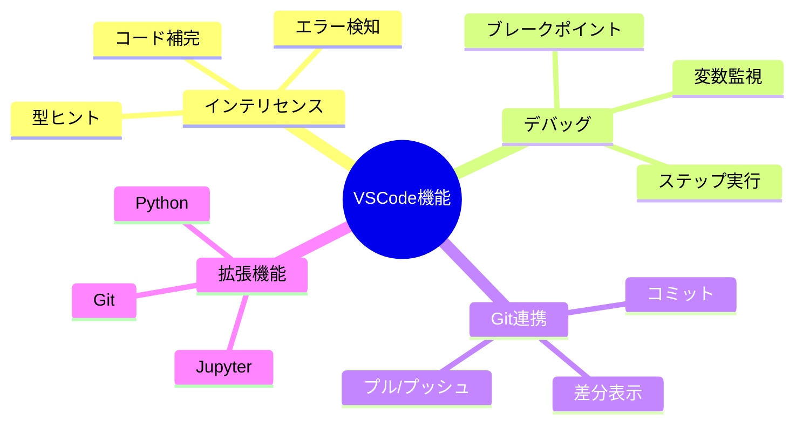
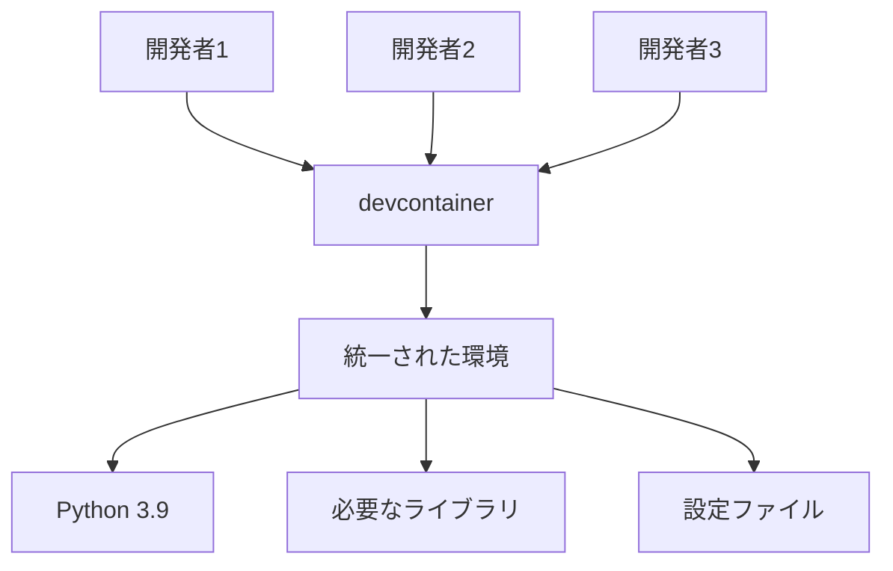
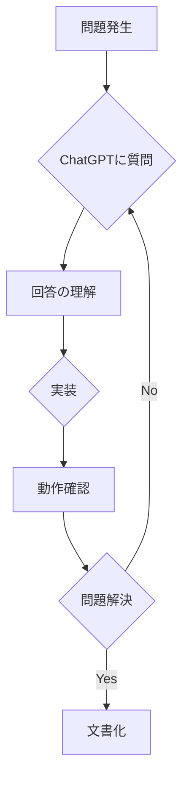
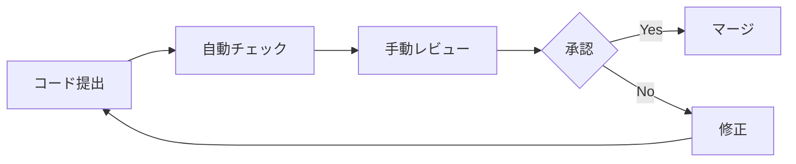

# データサイエンティストのための

# ソフトウェア工学入門

## 〜効率的な開発環境構築から実践的なコーディングまで〜

<div>
    
</div>

---

# 目次

1. 開発環境の構築と活用
   - VSCode と Jupyter Notebook
   - devcontainer による環境統一
2. 効果的なコーディング手法
   - コメントの重要性
   - 可読性の高いコード作成
3. AI ツールの活用
   - GitHub Copilot の活用
   - ChatGPT の効果的な使用方法
4. ベストプラクティス
   - コードレビュー
   - テスト駆動開発の基礎

---

# 1. なぜソフトウェア工学が重要か？

データサイエンティストにとって、ソフトウェア工学の知識が重要な理由：

- **再現性の確保**

  - 分析結果の再現
  - 他者との共同作業

- **保守性の向上**
  - 6 ヶ月後の自分が理解できるコード
  - チームでの開発効率向上


---

<!-- Marpと認識させるおまじない -->

## Basic Pie Chart

<!-- class名をmermaidとした要素タグ内に出力するMermaidコードを記載 -->
<pre class="mermaid">
pie title What Voldemort doesn't have?
  "FRIENDS" : 5
  "FAMILY" : 3
  "NOSE" : 45
</pre>

<!-- Mermaidを読み込み -->
<script type="module">
import mermaid from 'https://cdn.jsdelivr.net/npm/mermaid@11.4.1/dist/mermaid.esm.min.mjs';
mermaid.initialize({ startOnLoad: true });
</script>

---

# 2. 開発環境の構築

## 2.1 VSCode と Jupyter Notebook の統合

### VSCode 上での Jupyter Notebook 活用

1. VSCode 拡張機能のインストール
   - Jupyter
   - Python
   - IntelliCode

[image: VSCode で Jupyter Notebook を使用している画面のスクリーンショット]

---

## 2.2 VSCode の便利な機能



---

# 3. devcontainer による開発環境の統一

## 3.1 devcontainer とは

devcontainer は、開発環境を**コンテナ化**することで、チーム全員が同じ環境で開発できる仕組みです。



---

## 3.2 devcontainer 設定例

```json
{
  "name": "Python Data Science",
  "dockerFile": "Dockerfile",
  "extensions": ["ms-python.python", "ms-toolsai.jupyter", "github.copilot"],
  "settings": {
    "python.defaultInterpreterPath": "/usr/local/bin/python"
  }
}
```

---

# 4. コメントの重要性

## 4.1 なぜコメントが必要か

### 良いコメントの特徴

1. **なぜそのコードを書いたのか**を説明
2. 複雑なロジックの説明
3. 将来の注意点の記載

```python
# 悪い例
x = x + 1  # xに1を足す

# 良い例
# 異常値の影響を軽減するため、移動平均を計算する前にデータをシフト
x = x + OFFSET_VALUE  # カラム全体を正の値にシフト
```

---

## 4.2 docstring の活用

Python では、docstring を使用して関数やクラスのドキュメントを書くことができます。

```python
def calculate_moving_average(data: pd.Series,
                           window: int = 7) -> pd.Series:
    """時系列データの移動平均を計算します。

    Args:
        data (pd.Series): 対象の時系列データ
        window (int, optional): 移動平均の窓サイズ. デフォルトは7.

    Returns:
        pd.Series: 移動平均を計算した結果

    Examples:
        >>> df = pd.DataFrame({'sales': [100, 150, 200, 140, 180]})
        >>> calculate_moving_average(df['sales'], window=3)
    """
    return data.rolling(window=window).mean()
```

---

# 5. ユースケースに応じた適切なコーディング手法

## 5.1 探索的データ分析（EDA）


### Jupyter Notebook の活用

- セルごとの実行結果確認
- インタラクティブな可視化
- マークダウンによる説明の追加

---

## 5.2 本番環境用コード

本番環境では、以下の点に注意してコーディングを行います：

```python
# 設定値は環境変数から取得
import os
from dotenv import load_dotenv

# 環境変数の読み込み
load_dotenv()

# データベース接続情報
DB_HOST = os.getenv('DB_HOST')
DB_USER = os.getenv('DB_USER')
DB_PASS = os.getenv('DB_PASS')

def get_database_connection():
    """データベース接続を確立する関数

    Returns:
        Connection: データベース接続オブジェクト

    Raises:
        ConnectionError: 接続に失敗した場合
    """
    try:
        return create_connection(DB_HOST, DB_USER, DB_PASS)
    except Exception as e:
        logger.error(f"データベース接続エラー: {e}")
        raise ConnectionError("データベースに接続できません")
```

---

# 6. AI ツールの活用

## 6.1 GitHub Copilot

### Copilot の効果的な使用方法

1. **明確なコメントを書く**

```python
# 株価データから25日移動平均を計算し、
# ゴールデンクロス・デッドクロスのシグナルを検出する関数
def detect_ma_signals(price_data: pd.DataFrame) -> pd.DataFrame:
```

2. **関数の型ヒントを活用**
3. **docstring テンプレートの活用**

---

## 6.2 ChatGPT の活用



### 効果的な質問方法

1. コードのコンテキストを説明
2. エラーメッセージの全文を共有
3. 期待する動作を明確に説明

---

# 7. コードの品質管理

## 7.1 自動テスト

```python
import pytest
import pandas as pd

def test_calculate_moving_average():
    """移動平均計算関数のテスト"""
    # テストデータの準備
    test_data = pd.Series([1, 2, 3, 4, 5])

    # 関数の実行
    result = calculate_moving_average(test_data, window=3)

    # 期待値との比較
    expected = pd.Series([None, None, 2.0, 3.0, 4.0])
    pd.testing.assert_series_equal(result, expected)
```

---

## 7.2 コードレビューのポイント



### レビューの観点

1. コードの可読性
2. エラーハンドリング
3. パフォーマンス
4. セキュリティ

---

# 8. まとめ

効果的なソフトウェア開発のポイント：

1. **環境構築の自動化**

   - devcontainer の活用
   - 設定ファイルのバージョン管理

2. **コードの品質管理**

   - 適切なコメント
   - テストの実装
   - レビューの実施

3. **効率的な開発**
   - AI ツールの活用
   - 適切な開発フロー
   - チーム間のコミュニケーション

---

# 参考資料

- [VSCode 公式ドキュメント](https://code.visualstudio.com/docs)
- [Jupyter Notebook 公式ガイド](https://jupyter.org/)
- [Python 公式ドキュメント](https://docs.python.org/)
- [GitHub Copilot ドキュメント](https://docs.github.com/en/copilot)

---

# ワークショップ課題

1. devcontainer 環境の構築
2. サンプルコードのリファクタリング
3. ユニットテストの作成
4. GitHub Copilot を使用したコーディング

[image: グループワークのイメージ]

---

# Q&A

ご質問やご意見をお待ちしています。

[image: Q&A セッションのイメージ]
